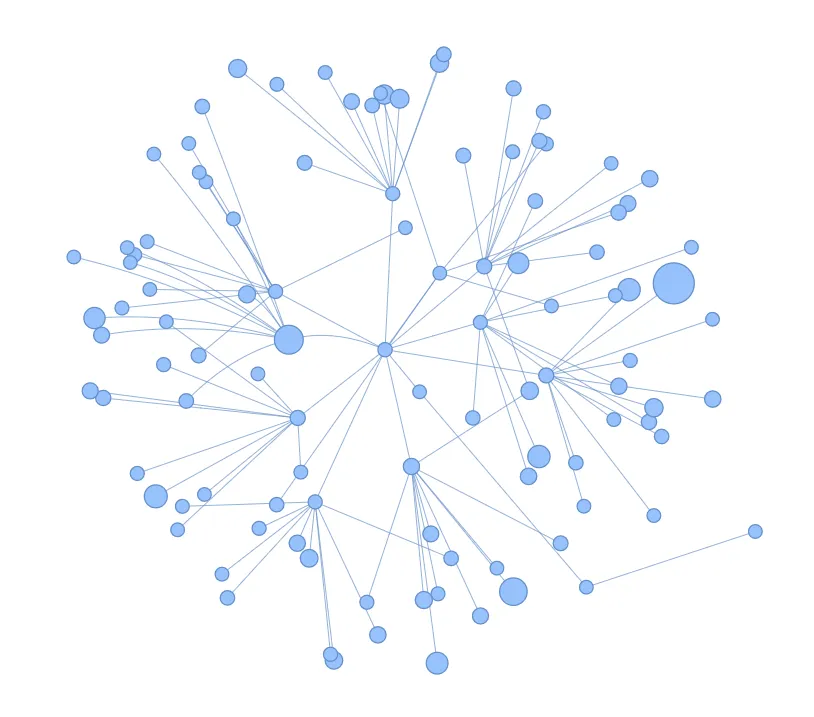

# Mastodon accounts graph viewer
## Dependencies
- PyVis
- Mastodon.py
## Usage
1. Install dependencies
2. Create config.py according to config.py.example
3. Run program
4. Open graph.html with graph showing recursive relations with your followers

